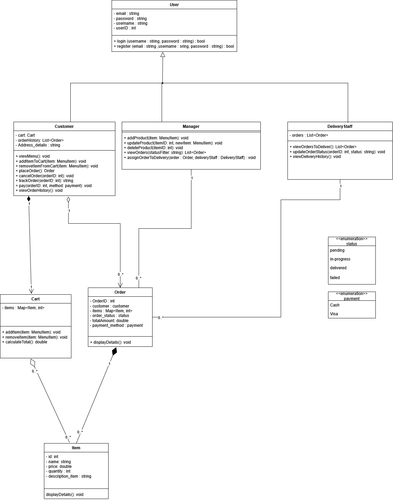
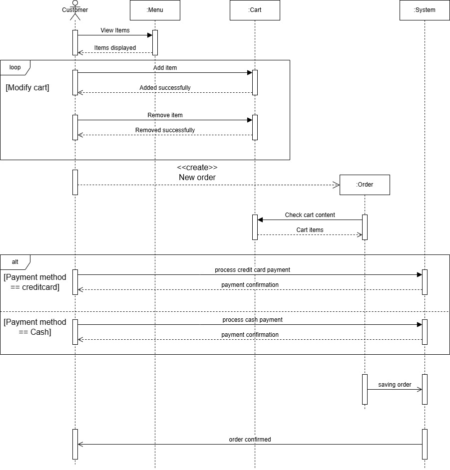
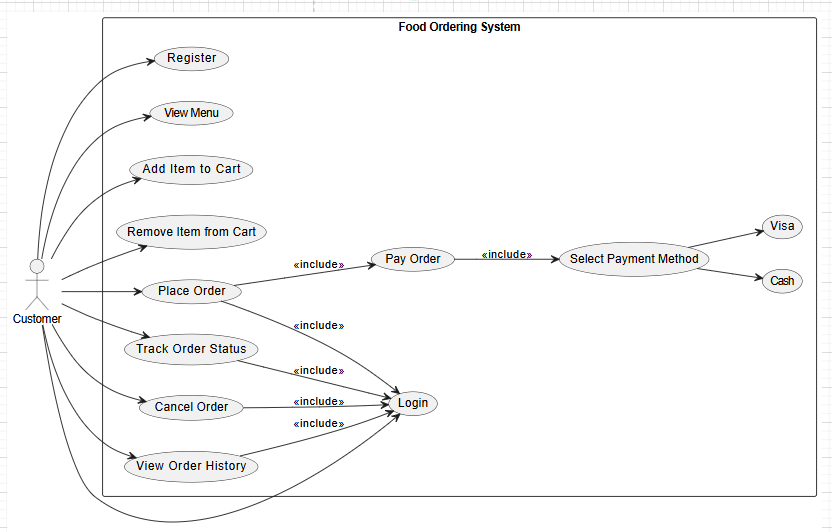
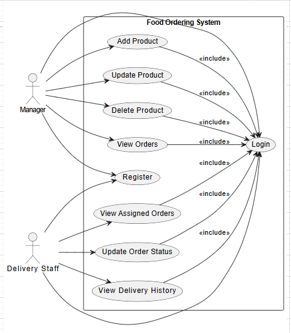
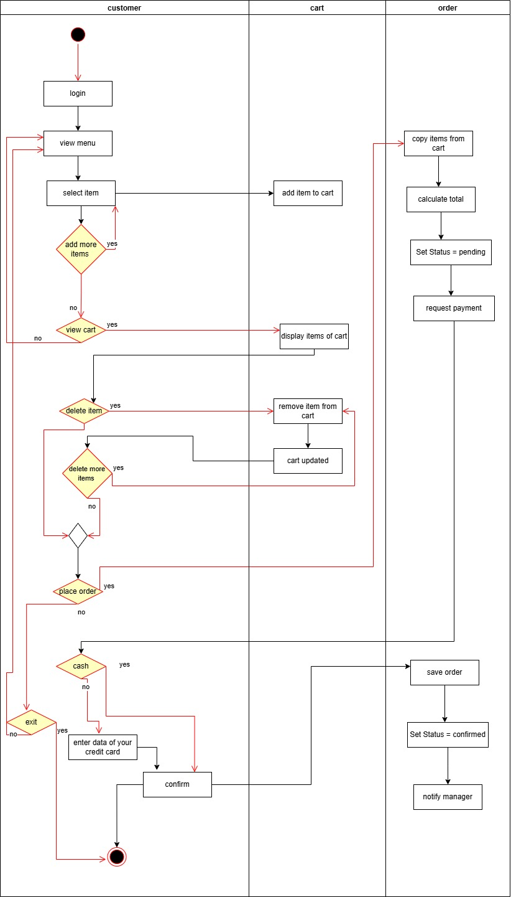
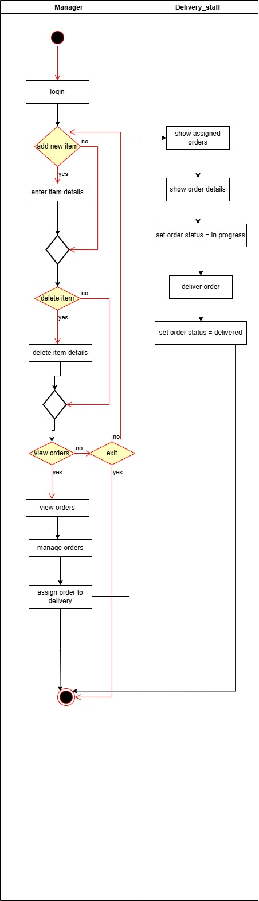

# Online Food Ordering System

## Overview
The **Online Food Ordering System** is a lightweight application that allows customers to browse a menu, add items to a cart, place orders, and view their order history. The system also provides functionalities for managers to manage menu items and orders, and for delivery staff to view and manage their assigned deliveries. All data is stored in local files, making the system easy to set up and use.

---

## Features

### Customer Features
- **Register & Login:** Create accounts and log in securely.
- **View Menu:** Browse available food items with details and prices.
- **Add/Remove Items to Cart:** Manage items in the shopping cart.
- **Place Order:** Confirm and submit orders.
- **Track Orders:** View order status using order ID and details (pending, shipped, delivered).
- **Payment Options:** Supports cash or visa payments.
- **Order History:** View past orders and details.

### Manager Features
- **Register & Login:** Secure access for managers.
- **Add Product:** Add new menu items.
- **Delete Product:** Remove items from the menu.
- **Update Product:** Modify details of existing menu items.
- **View Orders:** Filter and monitor orders by status.
- **Assign Orders to Delivery Staff:** Assign specific orders for delivery.

### Delivery Staff Features
- **Register & Login:** Secure access to delivery operations.
- **View Assigned Orders:** Track assigned orders and delivery details.
- **Update Order Status:** Change order status to pending, shipped, or delivered.
- **Delivery History:** View past deliveries and details.

---

## Non-Functional Requirements

| Requirement | Description |
|------------|-------------|
| **Availability** | The system should be accessible whenever needed. |
| **Scalability** | Able to handle a growing number of users or orders. |
| **Low Response Time** | Fast performance with minimal delays. |
| **Security** | Protect user data and prevent unauthorized access. |
| **Friendly User Interface** | Easy and intuitive for all users. |
| **Maintainability** | Easy to update code and add new features. |
| **Reliability** | Stable system with minimal downtime and errors. |

---

## Class Diagram

The system's classes and their relationships are represented in the diagram below:

> The class diagram reflects the **actual implementation**, including `Customer`, `Manager`, `Delivery_staff`, `Cart`, `Item`, `Order`, and the abstract `User` class. It shows proper inheritance, associations, and compositions.

---

## Sequence Diagram

The sequence diagram below illustrates how a customer interacts with the system to place an order:

---

## Use Case Diagrams

### 1. Customer Use Case

The use case diagram below shows the interactions a customer can perform in the system:

---

### 2. Manager & Delivery Staff Use Case

The use case diagram below shows the interactions for manager and delivery staff:

---

## Activity Diagrams

### 1. Customer Activity Diagram

The activity diagram below illustrates the customer workflow from browsing the menu to placing an order:

---

### 2. Manager & Delivery Staff Activity Diagram

The activity diagram below illustrates the manager and delivery staff workflow, including managing menu items and processing deliveries:

---
